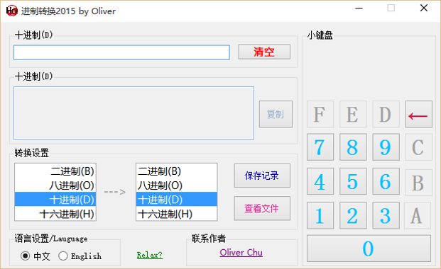
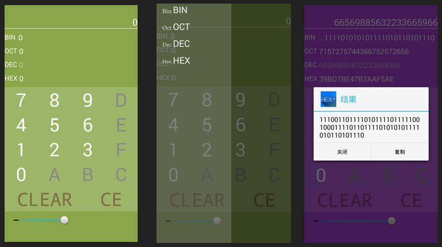

# Hex进制转换器

## Winform版本，基于.Net Framework 4.5。 
此版本程序具有以下特点： 
- 简单易上手，两种输入模式 
- 键盘仅支持进制数输入，鼠标输入面板智能识别，确保不会输入错误字符 实时转换进制，提升操作效率，自行是否选择保存结果（程序目录"ConvertedList.txt"）中 
- 添加音乐播放，支持"mp3,wma,wav,mid,mp4"等音频输出，用户可以将音频存入Songs文件夹即可 "tag.dat"为标志用户第一次使用弹出本说明的文件 
- "About Oliver"中是关于版本信息，作者信息 
- 支持中英文显示 转换范围十进制->二、八、十六进制 0~9223372036854775807

## Android版本

Apache License 2.0 
